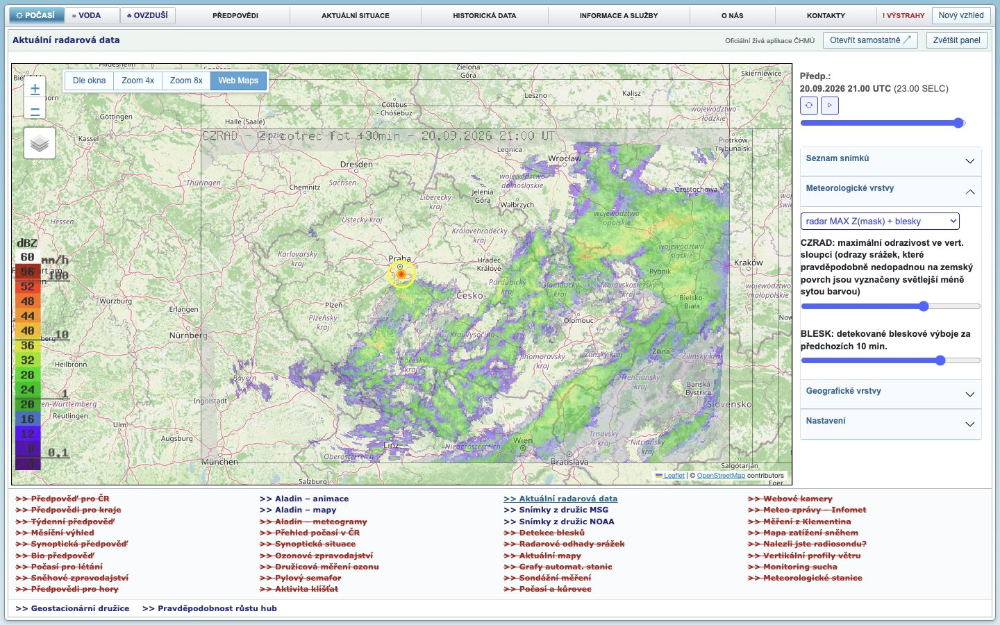
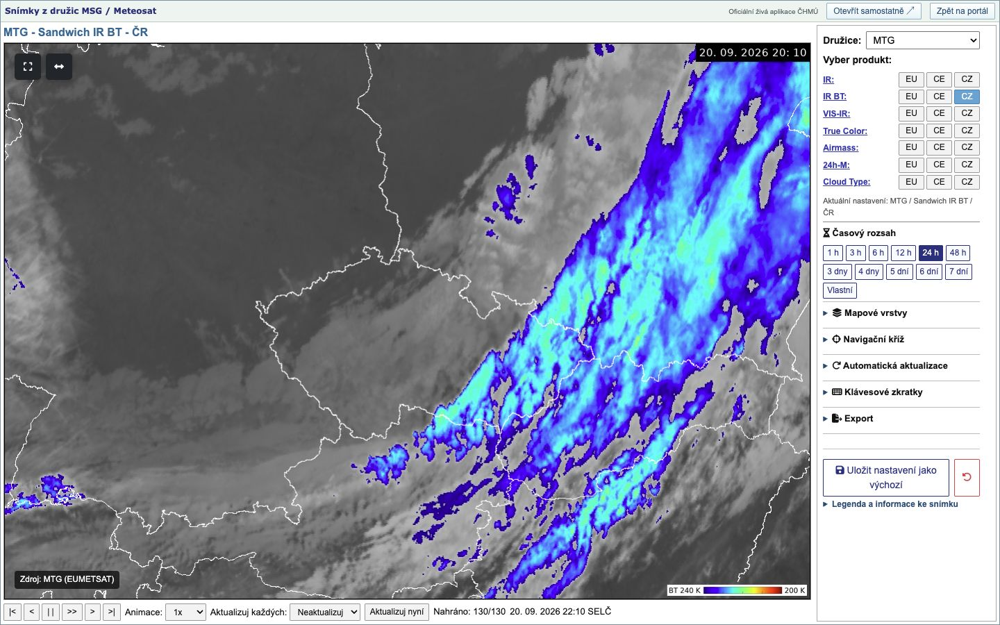

# ČHMÚ Classic – meteorologické výstupy

## Lokální beta 0.7.0-beta.10 – aplikace na jednom místě

**Chcete ji pouze používat? Začněte [návodem k instalaci a aktualizaci](INSTALL.md).**

**Testovací beta, nikoli dokončená obnova všech aplikací.** Lokální beta 10
navazuje na živé záložky Voda a Ovzduší a doplňuje úvodní předpověď počasí
o třídenní panel podle původního intranetu.
Na úzkém vysokém okně se pod mapou automaticky otevře živý seznam měst,
který využije jinak prázdné místo. Mapa si zachová správný poměr stran.
Seznam můžete sbalit; vaše volba zůstane zachovaná při změně velikosti okna.
Ze společných zdrojů se nyní sestavuje také Chrome/Edge doplněk. Poslední
veřejný [zdrojový balíček Chrome/Edge](https://github.com/barcuchj/chmi-classic/releases/tag/v0.7.0-beta.3)
zůstává beta 3; beta 10 je zatím místní a její instalace v Chromu ani Safari
nebyla vizuálně potvrzena. Safari balíček ani veřejné vydání zatím nejsou připraveny.
Po zveřejnění odpovídajícího userscriptu v `main` se tato beta instaluje stejným
odkazem jako dříve. Kdo chce vyzkoušet nové rozhraní,
otevře [instalační odkaz](https://raw.githubusercontent.com/barcuchj/chmi-classic/main/tampermonkey/chmi-classic.user.js)
a v Tampermonkey potvrdí aktualizaci. Nemějte současně aktivní starý userscript
i rozšíření ČHMÚ Classic, aby se jejich úpravy nepřekrývaly.

Na úvodní stránce ČHMÚ zůstává jen úzká nabídka **Počasí · Voda · Ovzduší**
a hlavní plocha pro vybranou aplikaci. Rozcestník pod mapou funguje takto:

- **Běžné kliknutí** zobrazí aplikaci uprostřed portálu.
- **Ctrl/⌘+klik nebo prostřední tlačítko** otevře samostatnou záložku na aktuální
  adrese ČHMÚ. S aktivním userscriptem se i tam použije klasický vzhled.
- **Zvětšit panel** dočasně schová okolní nabídky a rozcestník. **Zpět na portál**
  nebo klávesa Escape je vrátí bez nového načítání aplikace.
- **Otevřít samostatně** otevře právě vybranou aplikaci v nové záložce.
- Červený přeškrtnutý název není odkaz. Najetím myší zjistíte, proč daná
  aplikace ještě není obnovená.

Radar má stupnici ukotvenou uvnitř mapy. U Meteosatu se připravuje kompaktní
postranní ovládání s rozbalovacími podrobnostmi; mapa se při práci s ovladači
nemá ztrácet mimo okno. ALADIN přidává čtyři mapy a výraznější nápovědu
k posouvání času kolečkem myši.

Od bety 2 se čtyři mapy ALADINu skládají do jednoho nebo dvou řádků podle
velikosti okna. Pokud ČHMÚ pro zvolený termín snímek neposkytuje (například
srážky na začátku běhu), místo prázdného pole uvidíte vysvětlení.

Webkamery mají nově v rozcestníku aktivní odkaz na živou mapu ČHMÚ; výběr
kamer, snímek a časová osa používají původní komponenty zdrojové stránky.
Rozložení je připravené pro centrální panel i samostatnou záložku, ale
výsledné vykreslení této bety ještě nebylo ověřeno z nainstalovaného balíčku.
Grafy měření se nesimulují tam, kde je zdrojová stránka nenabízí.

Kompaktní meteogram zachovává nativní graf,
vyhledávání místa a hodinové tabulky; zapne se teprve po načtení skutečného
grafu. Nově si místně v prohlížeči pamatuje čtyři poslední otevřená místa,
podobně jako starý prohlížeč. Používá pouze ověřené odkazy na meteogramy ČHMÚ.
Odkaz **Aladin – meteogramy** v původním rozcestníku otevře ověřenou živou
stránku pro Prahu; jiné místo lze zvolit původním vyhledáváním ČHMÚ.
Rozložení v nainstalovaném doplňku ještě čeká na vizuální ověření.

Záložky **Voda** a **Ovzduší** v betě 8 otevírají současné oficiální živé
aplikace ČHMÚ v centrálním panelu. Voda používá aktuální vodní stavy a povodňovou
mapu, Ovzduší aktuální mapy kvality ovzduší. Userscript ponechává jejich
`#chmu-map-container` a nativní ovládání zdrojové stránky a přidává pouze
kompaktní old-portal obal a přepočet dostupné výšky. V okolí mapy skryje
rozsáhlé textové části současné stránky, které způsobovaly rolování; dostupné
zůstanou přes tlačítko **Nový vzhled**. Odkaz **Tabulka dat** otevírá oficiální
tabulku v nové záložce. Přímé otevření obou map používá stejný adaptovaný obal.
Původní archivní panely `hydro_map.html` a `air.html` nejsou zachyceny, proto
nejde o jejich přesnou vizuální kopii. Vykreslení bety 8 v nainstalovaném
Tampermonkey je dosud nutné potvrdit; prohlížeč zablokoval vývojové otevření
lokálního userscriptu.

Při otevření úvodní stránky je výchozí aplikací **Předpověď pro ČR**.
Mapa zachovává živé teploty a ikony ČHMÚ; vpravo vidíte tři dny s ikonami
a rozsahy teplot pro ráno/odpoledne. Kliknutím zvolíte období. Když ČHMÚ
období neposkytuje, buňka říká **Není údaj** a není odkazem. V úzkém okně
se panel přesune pod mapu. Samostatná stránka používá stejné rozložení.
Přístupný seznam měst rozbalíte pod mapou. Nejde o archivní předpověď ani
o přesnou kopii historické reliéfní mapy. Dnešek, zítřek a pozítří byly
vývojově ověřeny ve vestavěném prohlížeči. Rozložení při 1280 × 720 a
390 × 844 nemá scroll dokumentu; na výšku zůstává prostor kolem mapy,
aby se geografické zobrazení nedeformovalo. Ověření instalace a centrálního
rámce ještě zbývá.

**Co ještě není hotové:** historicky věrný reliéfní podklad úvodní mapy a řada
původních aplikací. Vodu a Ovzduší je po instalaci ještě nutné vizuálně potvrdit proti
živému DOM v běžném browseru; samotná implementace neznamená dokončený
instalační test. Podrobnosti a zbývající práce jsou v [TODO.md](TODO.md).

### Jak beta vypadá

**Radar v portálu:** úzká horní nabídka, mapa a původní rozcestník pod ní.



**Meteosat po kliknutí na Zvětšit panel:** mapa má celou pracovní plochu,
podrobnější nastavení se rozbaluje vpravo. Tlačítko Zpět na portál vrátí nabídky.



Jde o skutečné snímky vývojové bety z 20. 9. 2026, nikoli grafické návrhy.
Zobrazené počasí je stav při pořízení snímků, ne aktuální předpověď.
[Zdroje snímků a rozsah ověření](docs/screenshots/README.md).

ČHMÚ Classic je rozšíření a Tampermonkey userscript pro Chrome, Edge a Safari.
Na současných stránkách ČHMÚ vrací kompaktní vzhled inspirovaný původním webem,
zachovává živé komponenty a datové backendy ČHMÚ a od verze **0.6.0** rozšiřuje
jednotný katalog současných i archivních meteorologických výstupů.

Rozšíření **nenahrazuje data ČHMÚ vlastními mapami ani hodnotami**. Kde současný
oficiální produkt existuje, otevírá se jeho živá stránka. Vypnuté historické
prohlížeče jsou označeny jako **Archiv** a vedou na Internet Archive. Přímé
PNG/JPG/PDF adresy se nevymýšlejí ani nehardcodují, pokud je zdrojová stránka
ČHMÚ neposkytuje stabilně.

## Co umí verze 0.6.0

### Původních šest old-look aplikací

Tyto stránky používají specializovaný layout a zachovávají své původní živé
ovládání:

- [Radar – produkt](https://produkty.chmi.cz/radar/)
- [Radar na úvodní stránce ČHMÚ](https://www.chmi.cz/#chmi-classic-home-radar)
- [Meteosat – animovaný prohlížeč](https://produkty.chmi.cz/druzice/?time_range=24)
- [Polární družice](https://www.chmi.cz/namerena-data/polarni-druzice/true-color)
- [Geostacionární družice](https://www.chmi.cz/namerena-data/geostacionarni-druzice/true-color)
- [Pravděpodobnost růstu hub](https://www.chmi.cz/namerena-data/pravdepodobnost-rustu-hub)

Verze 0.4.1 zůstává základem: pracovní plocha se přizpůsobuje viewportu,
mapové komponenty dostávají resize notifikace a radar zachovává funkční
`Dle okna / Zoom 4x / Zoom 8x / Web Maps` bez překrytí nativního zoomu.
Společná navigace se na užších oknech zalamuje místo vytváření vodorovného
scrollbaru.

### Jednotný katalog „Produkty“

Tlačítko **Produkty** je dostupné v klasickém headeru. Na dalších podporovaných
stránkách vytváří ČHMÚ Classic vlastní kompaktní header s rychlou navigací na
Radar / Radar ČHMÚ / Meteosat / Polární / Geo / Houby a s katalogem.

Katalog obsahuje:

| Skupina | Hlavní živé výstupy |
| --- | --- |
| ALADIN | předpovědní mapy, teplota, oblačnost, srážky, vítr |
| Meteogramy | obce, letiště, hory, vodní plochy, bod na mapě |
| Webkamery | celorepublikový přehled oficiálních kamer |
| Naměřená data | teplota, srážky, srážkoměry HPPS, stanice, tlak, vlhkost, vítr, radar/blesky, Open Data |
| Synoptika | synoptická situace, historie synoptických situací, evropské stanice |
| Letectví | METAR/SPECI, SIGMET, TAF, SWL, nízká oblačnost, výškový vítr, radiosondáže, aerologie/pseudosondáže, VIS-IR, radar/blesky, meteogramy |
| Historie | přechody front, Klementinum, mapy teploty a srážek, územní řady, zprávy a PDF, Open Data |
| Archiv | starý radar INCA, MSG, AVHRR a archivní index starého ALADINu |

Stav odkazů v katalogu je viditelně rozlišen:

- **Živě** – současný oficiální zdroj ČHMÚ;
- **Legacy** – doložený původní endpoint starého portálu; může být po odstavení serveru nedostupný;
- **Přímý soubor/adresář** – doložený původní PNG/JPG/datový endpoint; data se do projektu nekopírují;
- **Archiv** – odkaz na konkrétní snapshot nebo Wayback index, bez živých dat;
- **Nedostupné** – historicky doložený produkt bez bezpečně ověřeného samostatného vieweru/endpointu.

## Historické aplikace a Web Archive

Verze 0.6.0 přidává samostatnou vrstvu `legacy.js` + `legacy.css` pro původní
`intranet.chmi.cz` / `portal.chmi.cz` a doložené statické aplikace pod
`/files/portal/docs/meteo/`. Jde o **vlastní adaptaci**, nikoli kopii starých
CSS/JS nebo obrazových assetů. Pokud původní DOM/backend ještě odpovídá, zůstává
zachován a rozšíření pouze přidá kompaktní klasický header, odkazy na současnou
náhradu/Web Archive a responzivní geometrii.

Systematicky jsou evidovány mimo jiné: starý radar INCA i statický radar, MSG,
AVHRR, ALADIN animace/mapy/meteogramy, webkamery, CELDN blesky a PNG adresář,
VIS-IR JPG adresář, staniční mapy/tabulky/grafy, radar+srážkoměry, aktuální
mapy, ozon/UV, sondáže a vertikální profily, sněhové zpravodajství, výškové
analýzy, Klementinum, přechody front a staré letecké ALADIN/WMO výstupy.

Přesná evidence původních URL, ověřených Wayback timestampů, stavu a licenčního
rozhodnutí je v [ARCHIVE_RESEARCH.md](ARCHIVE_RESEARCH.md). Kde nebyl bezpečně
ověřen konkrétní viewer, položka je v katalogu označena jako `Nedostupné`;
ČHMÚ Classic v takovém případě nevytváří falešné ovládání ani data.

## ALADIN – klasické mapy v aktuálním userscriptu

Na `https://produkty.chmi.cz/aladin/` se při otevření klasického vzhledu
automaticky zobrazí čtyři známé mapy:

1. Teplota ve 2 m
2. Oblačnost
3. Srážky za 3 h
4. Vítr v 10 m

V nabídce **Veličiny** můžete přidat například vlhkost, nízkou/střední/vysokou
oblačnost, ventilační index nebo srážky za 24 hodin. Rozložení se přizpůsobí
počtu map a velikosti okna. Výběr ovládá skutečné prvky ČHMÚ; userscript
nevyrábí vlastní předpověď ani náhradní snímky.

**Běh modelu** mění výpočet předpovědi. **Termín** posunete tlačítky nebo
kolečkem nad mapami po třech hodinách. Pokud ČHMÚ některý snímek neposkytuje,
pole zobrazí „Snímek chybí“; podrobnosti se ukážou po najetí myší.
Tlačítko **Nový vzhled** vrátí původní současné rozhraní ČHMÚ.

## Další old-look stránky

Pro další živé stránky z katalogu se nepřepisuje jejich aplikace. Rozšíření:

- odstraní pouze nadbytečný portálový rám tam, kde je to bezpečně rozpoznáno,
- rozšíří hlavní obsah na dostupnou šířku,
- omezí zbytečný horizontální overflow,
- zachová formuláře, tabulky, mapy, odkazy ke stažení a event handlery ČHMÚ,
- používá responzivní klasický header bez povinného horizontálního scrollování.

Podpora je záměrně řízena allowlistem cest. Ačkoli manifest potřebuje přístup k
`www.chmi.cz/*`, `catalog.js` mimo známé podporované cesty nic nestyluje.

## Živé, archivní a nehardcodované výstupy

### Živě

Ověřené současné rozcestníky zahrnují mimo jiné:

- `https://produkty.chmi.cz/aladin/`
- `https://www.chmi.cz/predpoved-pocasi/meteogramy-aladin/obce`
- `https://www.chmi.cz/namerena-data/webkamery`
- `https://www.chmi.cz/predpoved-pocasi/synopticka-situace`
- `https://www.chmi.cz/namerena-data`
- `https://www.chmi.cz/letectvi`
- `https://www.chmi.cz/namerena-data/historicka-data/klementinum`
- `https://opendata.chmi.cz/`

### Archiv a legacy

- radar INCA – konkrétní Wayback snapshot z 16. 8. 2026;
- MSG – konkrétní Wayback snapshot z 10. 2. 2026;
- AVHRR – konkrétní Wayback snapshot z 14. 6. 2026;
- ALADIN animace/mapy/meteogramy, webkamery a CELDN – doložené původní endpointy
  a Wayback indexy, pokud nebyl spolehlivě ověřen jeden konkrétní timestamp;
- staré portálové stránky stanic, synoptiky, ozonu, sněhu, historie a letectví
  jsou vedeny jako `Legacy` s odkazem na současnou náhradu, pokud je známa.

### PNG/JPG/PDF a export

ČHMÚ Classic dává přednost skutečným ovládacím prvkům zdrojové stránky a
oficiálním rozcestníkům Open Data. Nezavádí odhadnuté URL typu „poslední.png“.
Pokud ČHMÚ na konkrétní živé stránce poskytuje PDF, obrázek, XLS/CSV nebo jiné
stažení, zůstává tento odkaz zachován. Katalog obsahuje také samostatné odkazy
na Open Data a na zprávy/datové přehledy.

## Rychlá instalace přes Tampermonkey

1. Nainstalujte Tampermonkey.
2. Otevřete [userscript ČHMÚ Classic](https://raw.githubusercontent.com/barcuchj/chmi-classic/main/tampermonkey/chmi-classic.user.js).
3. Potvrďte instalaci.
4. Otevřete některou z podporovaných stránek nebo ALADIN a v headeru zvolte
   **Produkty**.

Userscript používá stejné JS/CSS zdroje jako rozšíření. Klasický režim lze
vypnout tlačítkem **Nový vzhled** a znovu zapnout z nabídky Tampermonkey nebo
plovoucím tlačítkem **Klasický vzhled**.

## Chrome / Edge

1. Otevřete `chrome://extensions` nebo `edge://extensions`.
2. Zapněte **Režim pro vývojáře**.
3. Zvolte **Načíst rozbalené**.
4. Vyberte složku `chrome-edge`.
5. Přes ikonu rozšíření lze otevřít katalog i hlavní aplikace.

Aktuální beta ZIP pro Chrome/Edge vytváří `./script/package_release.sh --chrome-only`.
Spouštění ve vložených rámcích je omezené na konkrétní adresy podporovaných
aplikací; obecný katalog na ostatních stránkách ČHMÚ se spouští jen nahoře.

## Safari na macOS

Safari wrapper je v:

`./safari/CHMURadarClassicSafari/CHMURadarClassicSafari.xcodeproj`

Zdroj pravdy je vždy `chrome-edge/`. Soubory v Safari `Resources` se negenerují
ručně; synchronizují je projektové skripty.

Lokální build a ověření na macOS:

```sh
./script/build_and_run.sh --verify
```

Safari build vyžaduje Xcode. Distribuce mimo vlastní Mac vyžaduje odpovídající
Apple signing/notarization workflow.

## Soukromí a oprávnění

Rozšíření ukládá pouze synchronizovanou volbu, zda je klasické rozhraní
zapnuté. Nemá telemetrii a neposílá uživatelská data.

Host permissions ve starším rozšíření a aktuální betě:

- `https://produkty.chmi.cz/radar/*`
- `https://produkty.chmi.cz/druzice/*`
- `https://produkty.chmi.cz/aladin/*`
- `https://www.chmi.cz/*`
- `https://hydro.chmi.cz/*`
- `https://intranet.chmi.cz/*` a `http://intranet.chmi.cz/*`
- `https://portal.chmi.cz/*` a `http://portal.chmi.cz/*`

Oprávnění pro staré domény slouží výhradně k lokálnímu old-look rámci a
propojení na současnou náhradu/Web Archive; nerozšiřují dostupnost vypnutého
serveru ani neobcházejí přístupová omezení.

Široký match na `www.chmi.cz/*` slouží pro jednotný katalog a allowlistované
živé produkty; mimo allowlist se stránka nemění.

## Technická omezení

- Struktura současného webu ČHMÚ se může změnit. Pak může být nutné aktualizovat
  selektory nebo allowlist cest.
- Klasický ALADIN používá ověřené nativní ovladače. Pokud ČHMÚ změní jejich
  identifikátory nebo strukturu stránky, může být nutná aktualizace userscriptu.
- Rozšíření neobchází přístupová omezení, cookies, autentizaci ani vypnutý
  `intranet.chmi.cz`.
- Internet Archive může mít jednotlivé historické soubory zachyceny neúplně.
- Přímé binární URL PNG/JPG/PDF nejsou garantovány tam, kde je ČHMÚ veřejně
  nevystavuje jako stabilní odkaz.

## Vývoj

Zdroj pravdy: `chrome-edge/`.

Tampermonkey:

```sh
node script/build_userscript.mjs
```

Safari sync/build na macOS:

```sh
./script/build_and_run.sh --verify
```

Release balíčky:

```sh
./script/package_release.sh --chrome-only
```

Safari zdrojový balíček 0.7 beta zatím nevydáváme; jeho synchronizace a build
čekají na samostatné ověření.

Podklady a původ odkazů jsou popsány v [THIRD_PARTY_NOTICES.md](THIRD_PARTY_NOTICES.md) a detailní archivní inventura v [ARCHIVE_RESEARCH.md](ARCHIVE_RESEARCH.md).
Přehled změn je v [CHANGELOG.md](CHANGELOG.md).
Projekt je licencován pod [MIT licencí](LICENSE).
